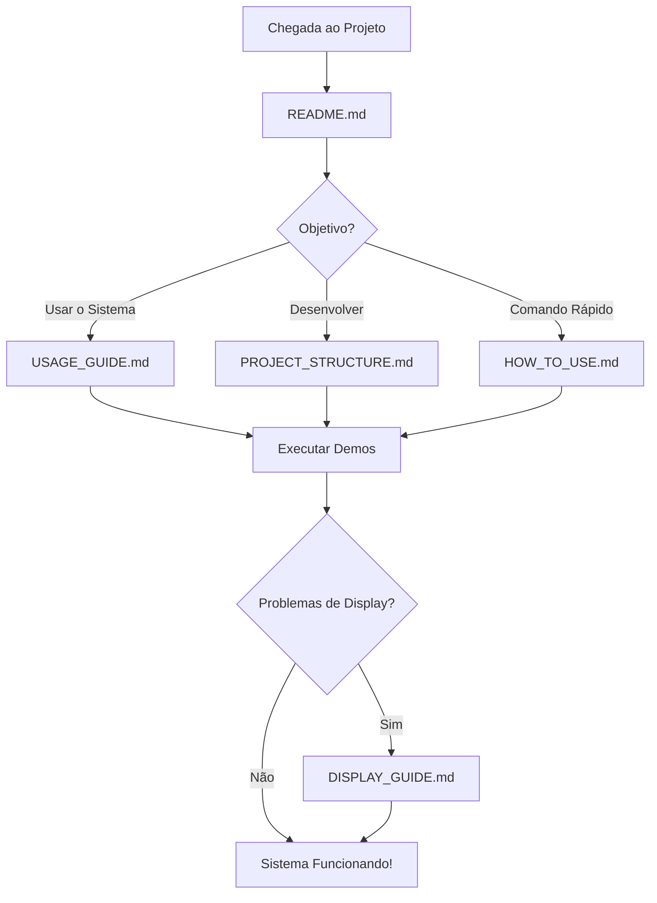

# TOFcam Documentation

Documentação completa do sistema TOFcam - Análise de profundidade e navegação em tempo real.

## 📚 Índice da Documentação

### 🚀 Para Usuários

| Documento | Descrição | Público-Alvo |
|-----------|-----------|--------------|
| **[Como Usar](HOW_TO_USE.md)** | Menu rápido de comandos por categoria | Todos os usuários |
| **[Guia de Uso](USAGE_GUIDE.md)** | Manual completo com exemplos e troubleshooting | Usuários avançados |
| **[Guia de Display](DISPLAY_GUIDE.md)** | Configuração de ambiente gráfico | Usuários com problemas de visualização |

### 🔧 Para Desenvolvedores

| Documento | Descrição | Público-Alvo |
|-----------|-----------|--------------|
| **[Estrutura do Projeto](PROJECT_STRUCTURE.md)** | Arquitetura e organização do código | Desenvolvedores e contribuidores |
| **[README Principal](../README.md)** | Visão geral e início rápido | Desenvolvedores iniciantes |

---

## 🎯 Navegação Rápida

### 👤 **Sou novo no projeto**
1. Leia o [README Principal](../README.md) 
2. Execute `python demos/run_demos.py`
3. Consulte [Como Usar](HOW_TO_USE.md) para comandos específicos

### 💻 **Quero usar o sistema**
1. Vá direto para [Guia de Uso](USAGE_GUIDE.md)
2. Escolha seu modo preferido (Web, Análise, Demos)
3. Se tiver problemas de display, veja [Guia de Display](DISPLAY_GUIDE.md)

### 🔨 **Quero desenvolver/contribuir**
1. Estude [Estrutura do Projeto](PROJECT_STRUCTURE.md)
2. Execute os testes: `python tests/run_tests.py`
3. Explore os demos: `python demos/run_demos.py`

---

## 📖 Resumo dos Documentos

### 🚀 [HOW_TO_USE.md](HOW_TO_USE.md)
**Menu de navegação rápida** - Comandos diretos organizados por categoria de usuário (Iniciantes, Desenvolvedores, Pesquisadores).

**Quando usar:** Quando você sabe o que quer fazer e precisa apenas do comando correto.

### 📚 [USAGE_GUIDE.md](USAGE_GUIDE.md)
**Manual completo** - Instruções detalhadas, configurações avançadas, interpretação de resultados, solução de problemas e casos de uso práticos.

**Quando usar:** Para aprender a usar o sistema completamente ou resolver problemas específicos.

### 🖥️ [DISPLAY_GUIDE.md](DISPLAY_GUIDE.md)
**Configuração de ambiente gráfico** - Solução de problemas relacionados ao sistema de janelas e visualização OpenCV.

**Quando usar:** Quando há problemas para exibir as janelas do OpenCV ou interface gráfica.

### 🏗️ [PROJECT_STRUCTURE.md](PROJECT_STRUCTURE.md)
**Arquitetura do sistema** - Explicação da organização do código, módulos, dependências e fluxo de execução.

**Quando usar:** Para entender como o código está organizado ou contribuir com o projeto.

---

## 🎯 Fluxo de Aprendizado Recomendado



---

## 📝 Convenções da Documentação

### Símbolos Utilizados
- 🚀 **Início rápido/Primeiros passos**
- 📚 **Documentação detalhada**
- 🔧 **Configuração/Setup técnico**
- 💡 **Dicas e sugestões**
- ⚠️ **Avisos importantes**
- ❌ **Problemas/Erros comuns**
- ✅ **Soluções/Status OK**

### Estrutura dos Comandos
```bash
# Comentário explicativo
comando_exemplo
```

### Estrutura dos Códigos
```python
# Comentário em português
codigo_exemplo()
```

---

## 🤝 Como Contribuir com a Documentação

1. **Melhorias:** Edite os arquivos `.md` diretamente
2. **Novos guias:** Adicione na pasta `docs/` e atualize este índice
3. **Problemas:** Documente soluções em `USAGE_GUIDE.md`
4. **Exemplos:** Adicione em `demos/` com documentação correspondente

---

💡 **Dica:** Sempre comece pelo [README principal](../README.md) para ter uma visão geral do projeto!