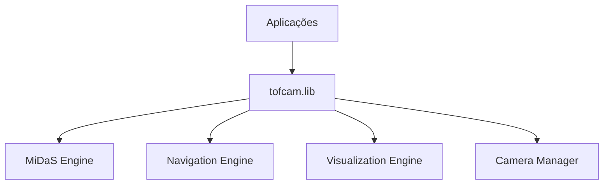
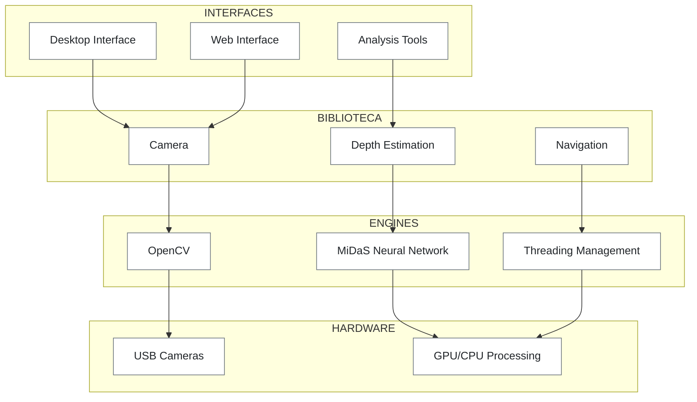
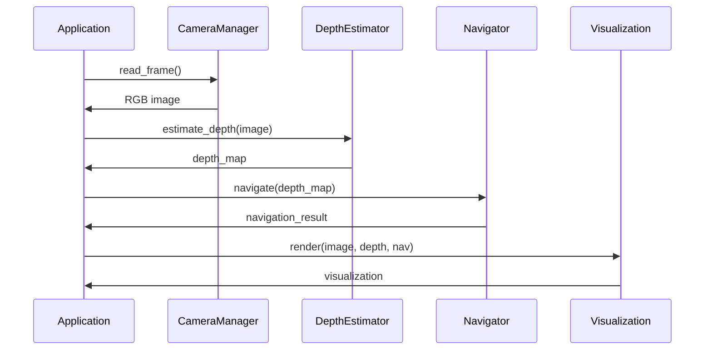

# 🏗️ Architecture - TOFcam

**Design e arquitetura do sistema TOFcam para desenvolvedores e contribuidores.**

## 📋 **Índice**

1. [Visão Geral](#visão-geral)
2. [Arquitetura em Camadas](#arquitetura-em-camadas)
3. [Biblioteca Central (tofcam.lib)](#biblioteca-central)
4. [Fluxo de Dados](#fluxo-de-dados)
5. [Módulos Principais](#módulos-principais)
6. [APIs e Interfaces](#apis-e-interfaces)
7. [Decisões de Design](#decisões-de-design)
8. [Como Contribuir](#como-contribuir)

---

## 🎯 **Visão Geral** {#visão-geral}

O TOFcam é um sistema modular de análise de profundidade em tempo real baseado em:

### **Princípios de Design**
- **Modularidade:** Componentes independentes e reutilizáveis
- **Flexibilidade:** Múltiplas interfaces (desktop, web, API)
- **Performance:** Otimização CPU/GPU com caching inteligente
- **Extensibilidade:** Arquitetura plugável para novos algoritmos

### **Componentes Principais**


---

## 🏛️ **Arquitetura em Camadas** {#arquitetura-em-camadas}



### **🎯 Propósito das Camadas**

#### **🎯 Interfaces de Usuário**
**Para que serve:** Pontos de entrada para diferentes tipos de usuários  
**Responsabilidade:** Apresentar funcionalidades de forma adequada ao contexto de uso

#### **🔧 Biblioteca Unificada (tofcam.lib)**
**Para que serve:** Centralizar toda lógica de negócio em API consistente  
**Responsabilidade:** Eliminar duplicação de código e garantir comportamento uniforme

#### **⚙️ Processamento Core**
**Para que serve:** Executar operações computacionalmente intensivas  
**Responsabilidade:** Otimizar performance através de engines especializados

#### **🔌 Recursos Físicos**
**Para que serve:** Abstrair acesso ao hardware do sistema  
**Responsabilidade:** Gerenciar dispositivos físicos e recursos computacionais

### **1. Application Layer**
- **main.py:** Interface desktop com 4 janelas
- **run.py:** Servidor web com streaming
- **main_analyzer.py:** Análise com persistência
- **demos/:** Demonstrações e exemplos

### **2. API Layer (tofcam.lib)**
- **Unified Interface:** API consistente para todos os módulos
- **Factory Pattern:** Creators para componentes principais
- **Configuration Management:** Sistema de config unificado

### **3. Engine Layer**
- **MiDaS Integration:** Neural network para depth estimation
- **OpenCV Backend:** Processamento de imagem e câmeras
- **Threading:** Processamento concorrente otimizado

### **4. Hardware Layer**
- **Camera Abstraction:** Suporte multi-câmera USB
- **GPU Acceleration:** CUDA quando disponível
- **Display Management:** X11/Wayland/Web fallback

---

## 📚 **Biblioteca Central (tofcam.lib)** {#biblioteca-central}

### **Estrutura Modular**
```python
tofcam/lib/
├── __init__.py          # Exports e factory functions
├── config.py            # Configurações e tipos (310 linhas)
├── camera.py            # Gestão de câmeras (325 linhas)
├── depth.py             # Estimação MiDaS (346 linhas)
├── navigation.py        # Algoritmos de navegação (346 linhas)
├── visualization.py     # Rendering pipeline (674 linhas)
├── web.py               # Interface web (574 linhas)
└── utils.py             # Utilitários e logging (531 linhas)
```

### **Factory Pattern Implementation**
```python
# API unificada através de factory functions
from tofcam.lib import (
    create_camera_manager,
    create_depth_estimator,
    create_navigator,
    create_render_pipeline
)
```

### **Módulos por Responsabilidade**

#### **config.py - Tipos e Configurações**
```python
# Enums para states e modos
class NavigationMode(Enum):
    STRATEGIC = "strategic"
    REACTIVE = "reactive"  
    HYBRID = "hybrid"

# Dataclasses para estruturas
@dataclass
class AnalysisFrame:
    timestamp: float
    frame_id: int
    rgb_image: np.ndarray
    depth_map: np.ndarray
    # ...
```

#### **camera.py - Gestão de Câmeras**
```python
class CameraManager:
    """Thread-safe multi-camera management"""
    
    def add_camera(self, config: CameraConfig) -> bool
    def read_frame(self, camera_id: int = None) -> np.ndarray
    def close_all(self) -> None
```

#### **depth.py - Estimação de Profundidade**
```python
class MidasDepthEstimator:
    """MiDaS neural network integration"""
    
    def estimate_depth(self, image: np.ndarray) -> np.ndarray
    def preprocess_image(self, image: np.ndarray) -> torch.Tensor
    def postprocess_depth(self, depth: torch.Tensor) -> np.ndarray
```

---

## 🔄 **Fluxo de Dados** {#fluxo-de-dados}

### **Pipeline Principal**


### **Processamento Concorrente**
```python
# Exemplo de pipeline otimizado
async def process_frame():
    # 1. Captura (thread dedicada)
    frame = await camera_manager.read_frame_async()
    
    # 2. Depth estimation (GPU se disponível)
    depth_task = asyncio.create_task(
        depth_estimator.estimate_depth_async(frame)
    )
    
    # 3. Navigation (CPU, paralelo)
    depth_map = await depth_task
    nav_result = navigator.navigate(depth_map)
    
    # 4. Visualization (thread de render)
    visualization = render_pipeline.render_complete(
        frame, depth_map, nav_result
    )
    
    return AnalysisFrame(...)
```

---

## 🧩 **Módulos Principais** {#módulos-principais}

### **1. Camera Management**
**Arquivo:** `camera.py`

**Responsabilidades:**
- Descoberta automática de câmeras USB
- Gestão thread-safe de múltiplas câmeras
- Configuração de resolução/FPS
- Fallback para imagens de teste

**Classes Principais:**
- `CameraSource`: Câmera individual
- `CameraManager`: Gestão multi-câmera
- `CameraConfig`: Configuração de câmera

### **2. Depth Estimation**
**Arquivo:** `depth.py`

**Responsabilidades:**
- Integração com MiDaS neural network
- Pré/pós-processamento de imagens
- Otimização CPU/GPU automática
- Cache de modelos para performance

**Classes Principais:**
- `MidasDepthEstimator`: Engine principal
- `DepthProcessor`: Pós-processamento
- `ModelManager`: Cache e loading

### **3. Navigation Algorithms**
**Arquivo:** `navigation.py`

**Responsabilidades:**
- Strategic navigation (planejamento global)
- Reactive avoidance (desvio de obstáculos)
- Zone mapping e análise espacial
- Hybrid navigation modes

**Classes Principais:**
- `ZoneMapper`: Mapeamento espacial
- `StrategicPlanner`: Navegação estratégica
- `ReactiveAvoider`: Desvio reativo
- `HybridNavigator`: Combinação inteligente

### **4. Visualization**
**Arquivo:** `visualization.py`

**Responsabilidades:**
- Rendering pipeline para múltiplas visualizações
- Overlay de informações de navegação
- Colorização de depth maps
- Interface gráfica consistente

**Classes Principais:**
- `RenderPipeline`: Engine de rendering
- `OverlayRenderer`: Sobreposições informativas
- `ColorMapper`: Mapeamento de cores

### **5. Web Interface**
**Arquivo:** `web.py`

**Responsabilidades:**
- Servidor Flask para interface web
- Streaming de vídeo em tempo real
- API REST para controle
- WebSocket para updates em tempo real

**Classes Principais:**
- `WebServer`: Servidor Flask
- `VideoStreamer`: Streaming pipeline
- `WebSocketManager`: Comunicação real-time

---

## 🔌 **APIs e Interfaces** {#apis-e-interfaces}

### **Factory Functions (Recommended)**
```python
from tofcam.lib import (
    create_camera_manager,    # → CameraManager instance
    create_depth_estimator,   # → MidasDepthEstimator
    create_navigator,         # → HybridNavigator
    create_render_pipeline    # → RenderPipeline
)

# Usage
camera_manager = create_camera_manager()
depth_estimator = create_depth_estimator()
```

### **Direct Imports (Advanced)**
```python
from tofcam.lib.camera import CameraManager, CameraConfig
from tofcam.lib.depth import MidasDepthEstimator
from tofcam.lib.navigation import HybridNavigator, NavigationConfig
```

### **Configuration System**
```python
from tofcam.lib import TOFConfig

# Configuração centralizada
config = TOFConfig()
config.camera.width = 1280
config.camera.height = 720
config.navigation.grid_size = (8, 12)
config.midas.model_type = "MiDaS_small"
```

---

## 🤔 **Decisões de Design** {#decisões-de-design}

### **1. Por que Factory Pattern?**
- **Simplicidade:** API única para criar componentes
- **Configuração:** Configuração centralized automática
- **Testing:** Fácil mocking e dependency injection
- **Backwards Compatibility:** Mudanças internas não quebram API

### **2. Por que Modular Architecture?**
- **Reusabilidade:** Módulos independentes
- **Testing:** Testes isolados por módulo
- **Performance:** Loading apenas do necessário
- **Maintenance:** Mudanças localizadas

### **3. Por que tofcam.lib?**
- **Zero Duplication:** Código centralizado
- **Consistent API:** Interface uniforme
- **Version Control:** Versionamento da biblioteca
- **Distribution:** Fácil empacotamento

### **4. Threading Strategy**
```python
# Camera capture: Dedicated thread
camera_thread = threading.Thread(target=camera_loop)

# Depth estimation: GPU/CPU optimized
depth_executor = ThreadPoolExecutor(max_workers=2)

# Visualization: Main thread (OpenCV requirement)
# Web server: Flask built-in threading
```

---

## 🤝 **Como Contribuir** {#como-contribuir}

### **Setup de Desenvolvimento**
```bash
# 1. Fork e clone
git clone https://github.com/your-username/TOFcam.git

# 2. Environment
conda activate opencv
pip install -r requirements.txt

# 3. Executar testes
python tests/run_tests.py
```

### **Adicionando Novos Módulos**

#### **1. Criar módulo em tofcam/lib/**
```python
# tofcam/lib/new_module.py
class NewComponent:
    def __init__(self, config):
        self.config = config
    
    def process(self, data):
        return processed_data
```

#### **2. Adicionar factory function**
```python
# tofcam/lib/__init__.py
from .new_module import NewComponent

def create_new_component(config: TOFConfig = None):
    config = config or TOFConfig()
    return NewComponent(config.new_component)
```

#### **3. Adicionar configuração**
```python
# tofcam/lib/config.py
@dataclass
class NewComponentConfig:
    parameter1: str = "default"
    parameter2: int = 42

@dataclass  
class TOFConfig:
    # ... existing configs
    new_component: NewComponentConfig = field(default_factory=NewComponentConfig)
```

### **Testing Guidelines**
```python
# Criar teste em tests/
class TestNewComponent(unittest.TestCase):
    def setUp(self):
        self.component = create_new_component()
    
    def test_process(self):
        result = self.component.process(test_data)
        self.assertIsNotNone(result)
```

### **Extending Navigation Algorithms**
```python
# Herdar de base classes
from tofcam.lib.navigation import BaseNavigator

class CustomNavigator(BaseNavigator):
    def navigate(self, depth_map: np.ndarray) -> NavigationResult:
        # Implementar algoritmo custom
        return NavigationResult(...)

# Registrar no sistema
def create_custom_navigator(config: NavigationConfig = None):
    return CustomNavigator(config)
```

---

## 📊 **Metrics e Performance**

### **Benchmarks Típicos**
- **Camera Capture:** ~30 FPS (USB 2.0 camera)
- **MiDaS Inference:** ~5-15 FPS (dependente de GPU)
- **Navigation:** ~100+ FPS (processamento CPU)
- **Visualization:** ~30 FPS (limitado por display)

### **Memory Usage**
- **Base System:** ~200MB
- **MiDaS Model:** ~100MB (cached)
- **Per Frame:** ~5-10MB (dependente de resolução)

### **Optimization Points**
1. **GPU Utilization:** MiDaS model loading
2. **Memory Management:** Frame caching strategy
3. **Thread Synchronization:** Producer-consumer queues
4. **Visualization:** Efficient rendering pipeline

---

## 📖 **Próximos Passos**

### Para Entender o Código
1. **[API Reference](api-reference.md)** - Documentação detalhada
2. **[User Guide](user-guide.md)** - Exemplos de uso
3. **Explore demos:** `demos/` directory

### Para Contribuir
1. **Issues no GitHub:** Encontre tarefas abertas
2. **Feature Requests:** Proponha melhorias
3. **Pull Requests:** Contribua com código

### Para Performance
1. **Profiling:** Use `cProfile` para analysis
2. **GPU Optimization:** Implementar batching
3. **Memory Optimization:** Implementar streaming

---

**[↑ Voltar ao índice da documentação](README.md)**